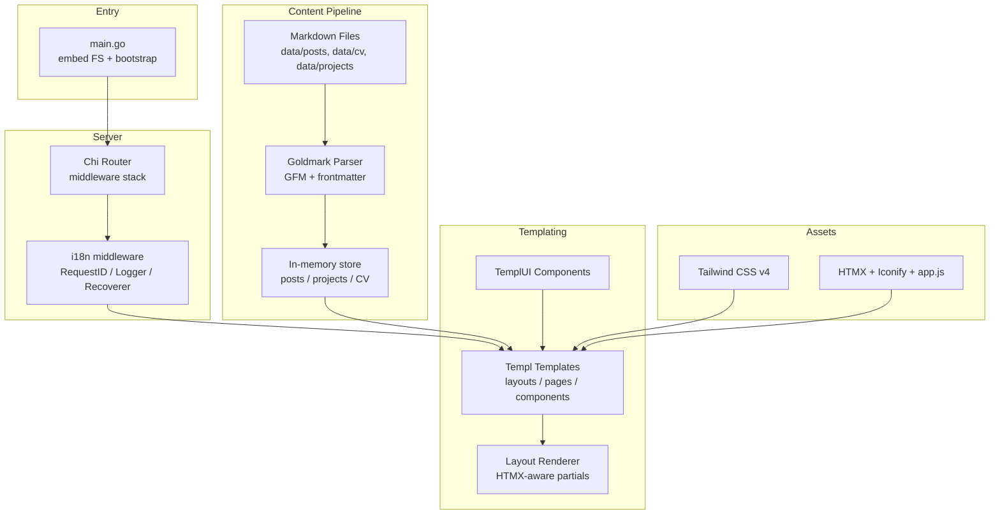
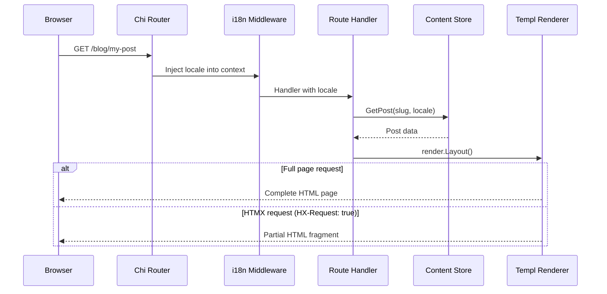

# Portfolio

A personal portfolio and blog built with Go, server-rendered HTML with HTMX, type-safe templates, and a Markdown-driven content system. Ships as a single binary with everything embedded.

## Credits

The initial scaffold (router + Templ + HTMX layout pattern) was lifted from [carsonkrueger/go-htmx-starter](https://github.com/carsonkrueger/go-htmx-starter). Most of the code has since been rewritten or extended, but the basic shape and a lot of the rendering ideas came from there. Thanks Carson.

---

## Features

- **Markdown-driven content** -- Blog posts, projects, and CV are written in Markdown with YAML frontmatter and parsed at startup with [Goldmark](https://github.com/yuin/goldmark)
- **i18n** -- German (default) and English with locale-aware content fallback and cookie-based language persistence
- **Dark mode** -- Toggle with localStorage persistence and system preference detection
- **Type-safe templates** -- UI built with [Templ](https://templ.guide) and [TemplUI](https://templui.com) components
- **HTMX navigation** -- SPA-like page transitions without a JavaScript framework
- **Single binary** -- Content and local static assets are embedded via `embed.FS`, templates compile into Go code
- **Print-ready CV** -- Dedicated print stylesheet for A4 PDF export

---

## Architecture



### Request Flow



---

## Project Structure

```
.
├── main.go                          # Entry point: embeds FS, inits i18n, starts server
├── app.css                          # Tailwind CSS v4 source (themes, custom styles)
├── .mise.toml                       # Tool versions + tasks for templ, tailwind and dev
├── .air.toml                        # Air config for hot-reload dev server
├── go.mod / go.sum                  # Go module definition
├── package.json                     # Tailwind CSS + plugins (Node.js)
│
├── data/                            # Markdown content (embedded at build time)
│   ├── posts/                       # Blog posts, one folder per post
│   │   └── {slug}/{locale}.md       # e.g. data/posts/learning-go-zero-values-and-types/de.md
│   ├── projects/                    # Projects, one folder per project
│   │   └── {slug}/{locale}.md
│   └── cv/                          # CV content ({locale}.md)
│
├── locales/                         # i18n translation files (embedded)
│   ├── de.json
│   └── en.json
│
├── internal/
│   ├── server/                      # Chi router, routes, middleware, HTTP server
│   │   └── server.go
│   ├── content/                     # Markdown parsing pipeline (Goldmark)
│   │   ├── convert.go               # Core markdown to HTML converter + frontmatter parser
│   │   ├── post.go                  # Post loading + in-memory store + archive helpers
│   │   ├── project.go               # Project loading + store
│   │   └── cv.go                    # CV loading
│   └── templates/
│       ├── constants/               # Shared DOM IDs
│       ├── templatetargets/         # Layout target definitions (for HTMX partials)
│       └── ui/
│           ├── layouts/             # Base layout, page layout, index (HTML shell)
│           ├── pages/               # Page templates: landing, blog, projects, CV, contact
│           └── components/          # Reusable UI: header, hero, latest posts/projects
│
├── pkg/
│   ├── i18n/                        # Internationalization: middleware, locale detection, translations
│   │   ├── i18n.go                  # Bundle init, T() translation func, locale context
│   │   └── middleware.go            # HTTP middleware: cookie -> query param -> Accept-Language
│   ├── util/
│   │   ├── request.go               # HTMX request detection
│   │   └── render/                  # Layout rendering (full page vs HTMX partial)
│   │       ├── layout.go            # HTMX-aware layout selection
│   │       └── templ.go             # Safe component joining
│   └── templui/                     # TemplUI component library (pre-built)
│
└── public/                          # Static assets (embedded at build time)
    ├── css/                         # Compiled Tailwind CSS
    ├── fonts/                       # Custom fonts (Barlow, Science)
    └── js/                          # TemplUI component scripts + app JS
```

---

## Getting Started

### Prerequisites

- [Go](https://go.dev/dl/) 1.26.2
- [Node.js](https://nodejs.org/) (for Tailwind CSS)
- [mise](https://mise.jdx.dev/) (optional, for tool version management)
- [air](https://github.com/cosmtrek/air) (for hot-reload dev server)

### Install Tools

If using mise:

```bash
mise install
```

### Run Development Server

```bash
mise run dev
```

This starts the dev server on `http://localhost:8080` with hot-reload. Air will:

1. Run `go tool templ generate` -- generates Go code from `.templ` files
2. Run `npx @tailwindcss/cli -i app.css -o ./public/css/index.css` -- compiles Tailwind CSS
3. Rebuild and restart on file changes

### Build for Production

```bash
mise run gen
go build -o portfolio .
```

Produces a single binary with all assets embedded.

---

## Content Management

Both posts and projects use a one-folder-per-item layout. The folder name is the slug, the file name is the locale.

### Adding a Blog Post

Create `data/posts/{slug}/{locale}.md` with YAML frontmatter:

```markdown
---
title: "Your Post Title"
description: "A short description"
tags: [go, learning]
date: 2026-05-10
---

Your markdown content here...
```

Concrete example:

```
data/posts/learning-go-zero-values-and-types/
├── de.md
└── en.md
```

The slug becomes the URL: `/blog/learning-go-zero-values-and-types`.

### Adding a Project

Same folder layout under `data/projects/`, with extra frontmatter fields:

```markdown
---
title: "Project Name"
description: "What it does"
tags: [kubernetes, golang]
date: 2026-01-15
category: platform
featured: 10
image: "/public/images/project.png"
repo: https://github.com/user/repo
demo: https://demo.example.com
---
```

Project metadata:

- `category` controls grouping on `/projects`: `infrastructure`, `platform`,
  `template`, `workstation`, `lab`, or `wip`.
- `featured` is an optional integer used for homepage ordering. Lower numbers
  appear first; projects without it fall back to date ordering.

### Adding CV Content

Markdown files in `data/cv/`:

```markdown
---
title: "CV"
---

## Experience

Your content here...
```

---

## Locale Fallback

When a user requests a locale that doesn't exist for a piece of content, the system falls back in this order:

1. Requested locale (e.g., `en`)
2. German (`de`) as default
3. Any available locale
4. Empty result

Locale is detected from (in priority order):

1. `lang` cookie
2. `?lang=` query parameter
3. `Accept-Language` HTTP header
4. Defaults to `de`

---

## Tech Stack

| Layer | Technology |
|---|---|
| Language | Go 1.26.2 |
| Router | [Chi](https://github.com/go-chi/chi) |
| Templates | [Templ](https://templ.guide) |
| UI Components | [TemplUI](https://templui.com) |
| Interactivity | [HTMX](https://htmx.org) + small vanilla JS |
| CSS | [Tailwind CSS v4](https://tailwindcss.com) |
| Markdown | [Goldmark](https://github.com/yuin/goldmark) with GFM, footnotes, frontmatter |
| i18n | [go-i18n](https://github.com/nicksnyder/go-i18n) |
| Icons | [Iconify](https://iconify.design) |
| Hot Reload | [Air](https://github.com/cosmtrek/air) |
| Task Runner | [mise tasks](https://mise.jdx.dev/tasks/) |

---

## Routes

| Method | Path | Description |
|---|---|---|
| GET | `/` | Landing page with latest posts and projects |
| GET | `/blog` | Blog archive with client-side filtering |
| GET | `/blog/{slug}` | Individual blog post |
| GET | `/projects` | All projects |
| GET | `/projects/{slug}` | Individual project detail |
| GET | `/cv` | CV / resume |
| GET | `/cv/print` | Print-optimized CV |
| GET | `/contact` | Contact page |
| POST | `/contact` | Submit contact form |
| GET | `/lang?set=en` | Set language cookie and redirect |
| GET | `/public/*` | Static assets (CSS, fonts, JS) |
| GET | `/metrics` | Prometheus metrics |
| GET | `/healthz` | Liveness probe |
| GET | `/readyz` | Readiness probe |

---

## License

Personal project. All rights reserved.
