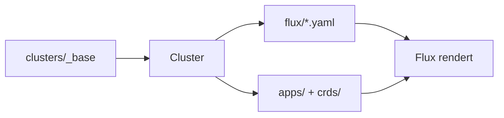

## Überblick

GitOps für meine Homelab-Infrastruktur. Flux pollt das Repository und synchronisiert es in den Cluster; ein Push genügt. Ein neues Cluster entsteht als ein kleines Verzeichnis mit Variablen und Patches, nicht als Kopie der App-Manifeste.

## Stack & Architektur

- Flux v2, betrieben über den Flux Operator
- Helm und Kustomize für die Manifeste
- Traefik als Ingress, MetalLB als Load Balancer
- cert-manager mit Let's Encrypt (Netcup-DNS-Challenge) für TLS
- SOPS und age für Secrets
- Proxmox CSI als Storage, Velero für Backups
- kube-prometheus-stack, Loki, Tempo und OpenTelemetry fürs Monitoring
- Renovate für Dependency-Updates
- go-task als Task-Runner, verwaltet über mise

**Multi-Cluster:**

```text
kubernetes/clusters/
├── _base/
│   ├── apps.yaml        # gemeinsame Flux-Kustomizations
│   └── crds.yaml        # gemeinsame CRD-Kustomizations
├── k8s-home-01/
│   ├── flux/
│   │   ├── apps.yaml    # Variablen + Chart-Versionen
│   │   └── crds.yaml    # CRD-Versionen
│   ├── apps/            # optionale App-Patches
│   └── crds/            # optionale CRD-Patches
├── k8s-dev/
│   └── ...
└── k8s-portfolio/
    └── ...
```



App-Manifeste liegen einmal in der Base. Pro Cluster ändern sich nur Variablen, Versionen und optionale Patches.

**Variablen-Substitution:** Flux setzt beim Sync die Variablen aus `flux/apps.yaml` per `postBuild` in alle referenzierten Kustomizations und deren HelmRelease-Werte ein. Domain, MetalLB-IPs, SMTP-Host und die Chart-Version jeder App stehen so an einer einzigen Stelle pro Cluster.

**Defaults-Component:** Eine Kustomize-Component unter `components/flux-defaults/` patcht jede `Kustomization` und jeden `HelmRelease` mit gemeinsamen Werten: Intervall, Timeout, `prune` und `wait`. Kein Boilerplate pro Ressource.

**CRDs vor Apps:** Eine `cluster-crds`-Kustomization bringt die CRD-HelmReleases zuerst aus; `cluster-apps` hängt per `dependsOn` daran. Erst wenn die CRDs stehen, werden die Apps angewendet.

**Reihenfolge mit `00-pre/`:** Dienste, die vorab einen Datenbank-User oder ein Secret brauchen, legen diese in einem `00-pre/`-Unterverzeichnis ab. Die übergeordnete Kustomization wartet, bis `00-pre` healthy ist, bevor der App-HelmRelease läuft.

## Git-Ref

Jeder Cluster zieht aus demselben GitRepository, der Git-Ref ist aber eine Cluster-Variable (`FLUX_SYNC_REF`). Standard ist `refs/heads/main`, der Cluster folgt also dem Branch. Statt eines Branches lässt sich ein Tag oder ein fester Commit eintragen; dann bleibt der Cluster auf genau diesem Stand und übernimmt neue Commits erst, wenn der Ref bewegt wird. So kann man auf Dev erst ausrollen und Produktion auf einem geprüften Stand pinnen oder einen Cluster während größerer Änderungen einfrieren.

## Secrets

Verschlüsselt im Repo, entschlüsselt nur im Cluster. Secrets werden mit SOPS und age verschlüsselt; der private age-Key wird nie committet. Flux liest ihn aus einem `sops-age`-Secret, das beim Bootstrap angelegt wird. Ein pre-commit-Hook verschlüsselt beim Commit jede Datei neu, die gerade im Klartext vorliegt.

## CI

Zwei Pipelines validieren jede Änderung mit `flux-local`. GitHub Actions führt `flux-local test` und `flux-local diff` bei jedem PR aus, der `kubernetes/` berührt. GitLab CI macht dieselbe Validierung plus die geplanten Renovate-Läufe; ein `flux-filter`-Job erkennt, ob eine Änderung global ist (alle Cluster) oder clusterspezifisch (nur das Geänderte). Die lokale Validierung über go-task spiegelt die CI exakt.

## Dependency-Updates

Renovate läuft am Wochenende und öffnet PRs für Chart-Versionen. Patch- und Minor-Updates für den Produktions-Cluster werden nach grüner CI automatisch gemergt. Ein eigener Regex-Manager liest die `# renovate:`-Annotationen in `flux/apps.yaml` und `flux/crds.yaml` und verfolgt jede Chart-Version einzeln.
