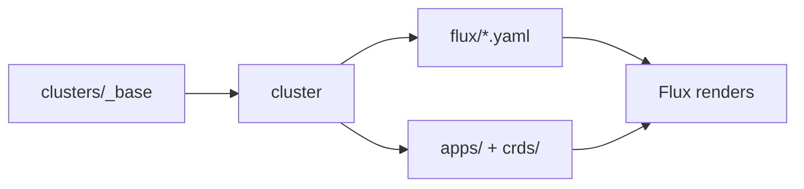

## Overview

GitOps for my homelab infrastructure. Flux polls the repository and syncs it into the cluster; one push is enough. A new cluster is a single directory of cluster-specific variables, not a copy of the app manifests.

## Stack & Architecture

- Flux v2, run via the Flux Operator
- Helm and Kustomize for the manifests
- Traefik for ingress, MetalLB as load balancer
- cert-manager with Let's Encrypt (Netcup DNS challenge) for TLS
- SOPS and age for secrets
- Proxmox CSI for storage, Velero for backups
- kube-prometheus-stack, Loki, Tempo and OpenTelemetry for monitoring
- CloudNative-PG, MariaDB Operator and Percona MongoDB for databases
- Renovate for dependency updates
- go-task as the task runner, managed via mise

**Multi-cluster:**

```text
kubernetes/clusters/
├── _base/
│   ├── apps.yaml        # shared Flux Kustomizations
│   └── crds.yaml        # shared CRD Kustomizations
├── k8s-home-01/
│   ├── flux/
│   │   ├── apps.yaml    # variables + chart versions
│   │   └── crds.yaml    # CRD versions
│   ├── apps/            # optional app patches
│   └── crds/            # optional CRD patches
├── k8s-dev/
│   └── ...
└── k8s-portfolio/
    └── ...
```



App manifests live once in the base. Per cluster only variables, versions and optional patches change.

**Variable substitution:** At sync time Flux injects the variables from `flux/apps.yaml` via `postBuild` into all referenced Kustomizations and their HelmRelease values. Domain, MetalLB IPs, SMTP host and each app's chart version thus sit in a single place per cluster.

**Defaults component:** A Kustomize component under `components/flux-defaults/` patches every `Kustomization` and `HelmRelease` with shared values: interval, timeout, `prune` and `wait`. No per-resource boilerplate.

**CRDs before apps:** A `cluster-crds` Kustomization rolls out the CRD HelmReleases first; `cluster-apps` hangs off it via `dependsOn`. Apps are applied only once the CRDs are in place.

**Ordering with `00-pre/`:** Services that need a database user or a secret beforehand place those in a `00-pre/` subdirectory. The parent Kustomization waits until `00-pre` is healthy before the app HelmRelease runs.

## Git Ref

Every cluster syncs from the same GitRepository, but the Git ref is a per-cluster variable (`FLUX_SYNC_REF`). The default is `refs/heads/main`, so the cluster follows the branch. Instead of a branch a tag or a fixed commit can be set; the cluster then stays on exactly that state and only picks up new commits once the ref is moved. This lets you roll out to dev first and pin production to a vetted state, or freeze a cluster during larger changes.

## Secrets

Encrypted in the repo, decrypted only in the cluster. Secrets are encrypted with SOPS and age; the private age key is never committed. Flux reads it from a `sops-age` secret created during bootstrap. A pre-commit hook re-encrypts, on commit, any file that is currently in plaintext.

## CI

Two pipelines validate every change with `flux-local`. GitHub Actions runs `flux-local test` and `flux-local diff` on every PR touching `kubernetes/`. GitLab CI does the same validation plus the scheduled Renovate runs; a `flux-filter` job detects whether a change is global (all clusters) or cluster-specific (only what changed). Local validation via go-task mirrors CI exactly.

## Dependency Updates

Renovate runs on weekends and opens PRs for chart versions. Patch and minor updates for the production cluster are auto-merged once CI is green. A custom regex manager reads the `# renovate:` annotations in `flux/apps.yaml` and `flux/crds.yaml` and tracks each chart version independently.
